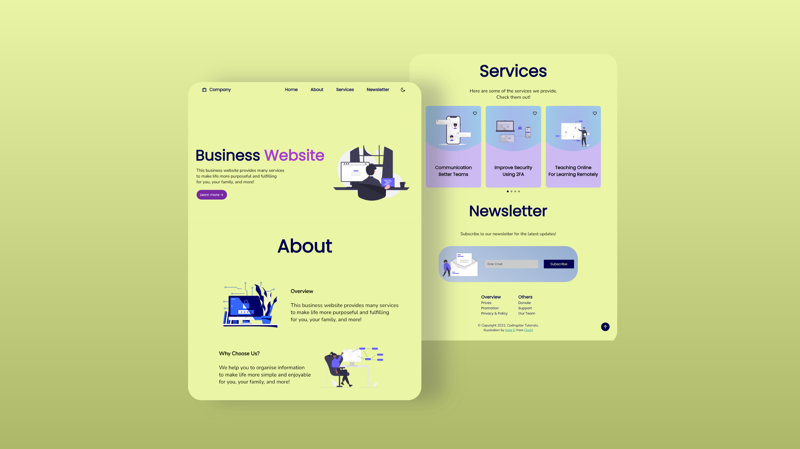

# Company Website Template
## Full Video Tutorial: https://youtu.be/HEHJmneClg0

Get Full Source Code: https://www.buymeacoffee.com/cstutorials/e/102643

Join this channel to see more tutorials like this responsive website! [Codingstar Tutorials](https://www.youtube.com/channel/UCadItSVcBu0pS3ES8UJQJ1A)

This Website Template contains:
<ul>
    <li>A preloader that shows before the page completes loading</li>
    <li>A navigation bar that is fixed at the top of the screen   and can direct to a section of the website.   It will be blurred when user scrolls down.</li>
    <li>Swiper to swipe multiple containers</li>
    <li>Scroll to top button that only appears when the user scrolls down   and will disappear when user goes back to the top</li>
    <li>Custom scrollbar</li>
    <li>Subscribe form design</li>
    <li>Dark/Light mode toggle</li>
    <li>Slide in when in view</li>
    <li>Compatible with most devices' screens, such as mobile phones</li>
    <li>A website favicon</li>
<ul>
    

